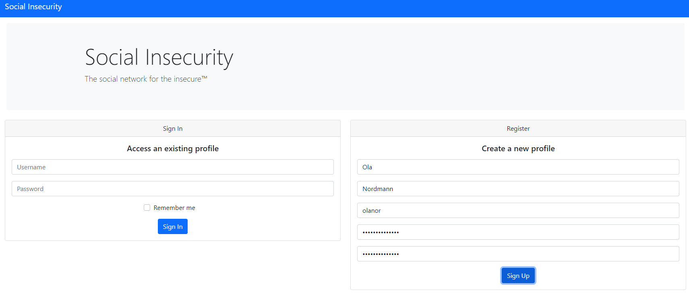
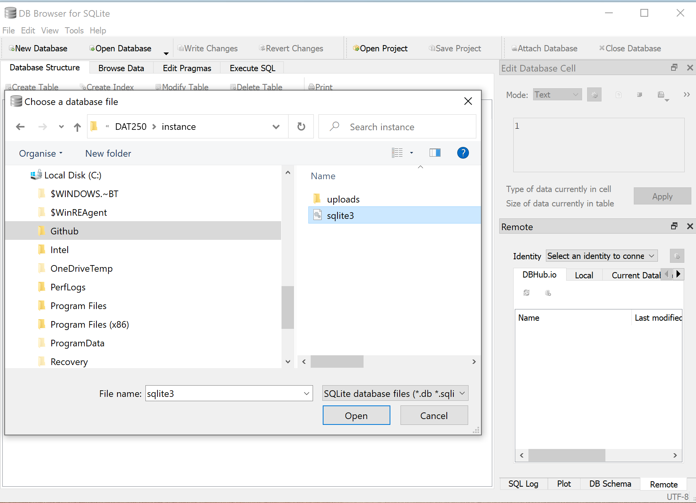
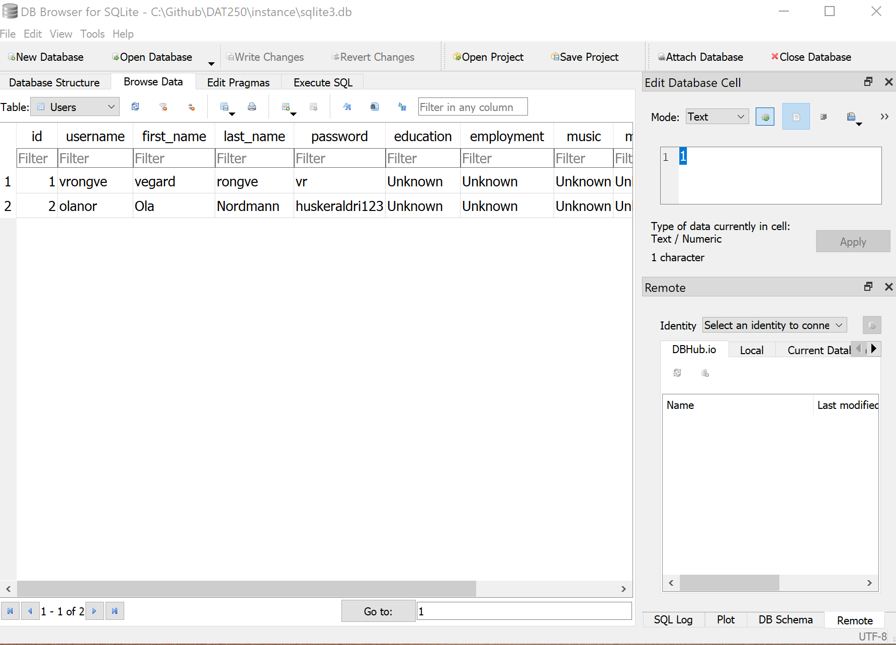

# Social Insecurity - Penetration Testing Report

run shift+ctrl+v to visualize the markdown in separate window

## Introduction

Tester: Vegard Rongve
 
Tools and methodology: OWASP Testing Guide
-   Manual inspection
-   Code Review
-   Penetration testing - OWASP Zap
  
Application: Social Insescurity

EXPLOITED -> UTNYTTES

Phase 1 Passive mode:
- In this phase the tester tries to understand the applications logic and plays with the application. (The information gathering section explains how to perform a passive mode test)

Phase 2 Active mode:
- In this pahse the tester begins to test using the methodology described in the following sections. The set of active tests have been splite into 11 sub-categories.
• Information Gathering
• Configuration and Deployment Management Testing
• Identity Management Testing
• Authentication Testing
• Authorization Testing
• Session Management Testing
• Input Validation Testing
• Error Handling
• Cryptography
• Business Logic Testing
• Client Side Testing

Testing Techniques:
- Manual inspection
- Code Review
  - Remove the guess work of black box testing by looking at what is actually going on in the code.
  - Examples of issues that are particularly conducive to being found through source code reviews include:
    - concurrency problems
    - flawed business logic
    - access control problems
    - cryptographic weaknesses as well as backdoors
    - input validation
- Penetration testing
  - Penetration testing has been a common technique used to test 
network security for many years. It is also commonly known as 
black box testing or ethical hacking. Penetration testing is essentially the “art” of testing a running application remotely to find 
security vulnerabilities, without knowing the inner workings of 
the application itself. 
  -   Typically, the penetration test team would 
have access to an application as if they were users. The tester acts 
like an attacker and attempts to find and exploit vulnerabilities. In 
many cases the tester will be given a valid account on the system

The need for a balanced approach. Need to use manual and automated testing.

Any security issues that are found will be presented to the system owner with an asseessment of the impact, a proposal for mitigation or a technical solution.

## Vulnerability notes:

# Vulnerability Assessment

### 1. Weak Password

Category: 
- A07: Identification and Authentication Failures

Descirption: 
- Users of the application have complete freedom to choose their own passwords, without any strict password policy in place. This means they can even select a single-letter password.

Potential Impact:
- The potential impact of having a weak password is significant, as an attacker might get hold sensitiv data (depending on the purpose of the application). An attacker can by using for instance the brut force technique relatively easy break the password and get access to a user account (given that the attacker knows the username). 

Affected part of the application:
-   The affected part is the registration form of the application where the user is setting a password.

Potential Solution: 
- Enforcing password complexity
- Educate users about the importance of strong passwords
- MFA (multi-factor authentication)
- Lock out mechanism
  - If an attacker guesses the password wrong multiple times the account should be locked. Reducing the posibiltiy of successfull brut force attacks.

### 2.User enumeration

Category: 
- A05: Security Misconfiguration

Description:
- Interacting with the application allows users to identify valid usernames. When a user enters a valid username during the login process, the application indicates that the password is incorrect. Conversely, if an invalid username is entered, the application informs the user that the user does not exist.

Potential impact:
- It makes it easier for malicous actors to identify valid usernames. Armed with a list of valid usernames, attackers can launch various credential-based attacks, such as bruce force attacks. 
- User enumartion can be seen as a privacy violation, as i exposes information about which usernames are registered with the service. 

Affected part of the applicaton:
- The affected part of the app is the login section. The application provides a notification message in the top of the broweser window when an invalid password or username is entered. 

Potential Solution:
- The application should ensure consistent error messages or responses regardless of whether the username or password is incorrect

### 3. Bypassing access control by modifying URL

Cateogory: 
- A01:Broken Access Control

Description:
- By modifying the url, given a valid username, it is possible to login in to the application as that user without entering the password. Given that a valid username is for example "grong", entering the following in the URL "http://127.0.0.1:5000/stream/grong" will access the app as "grong" and navigate the user to the stream page. 

Potential impact:
- It allows unauthorized access to an account by simply knowing the username, which could lead to unauthorized data access, account manipulation, or other securtiy risks.

Affected part of the application:
- The Broken Access Control issue affects the user authentication and authorization system of the application. Specifically, it allows unauthorized access to user accounts by manipulating the URL with a valid username, granting access to the user's account without requiring the correct password.

Potential Solution:
- ??

### 4. Edit another user's profile

Cateogory: 
- A01:Broken Access Control

Description:
- The app is lacking session management. Currently an attacker is able to modify anyones profile by for instance adding the user as friend, and then pressing on the username of that user. By doing so the user will navigate to the profil page of the selected user. Here, a user is able to press the edit button and then modify the profile to another user. 

Potential impact: 
- The potential impact of the describe issue is significant and could have several adverese consequences for the application's security and user data.
  - Unauthorized profile modification:
    - Attackers can modify the profiles of others without their consent or proper authorization. This could lead to the unauthorized modification of personal inforamtion or other user-specific data, potentially causing confusion, misinformation, or privacy breach.
  - Data integrity:
    - Unauthorized profile modification could result in a loss of data integrity as user profiles may contain critical information related to their identify, preferences, or interactions with the application. This could impact the trustworthiness of the platform.

Affected part of the application:
- The affected part of the described issue above is the profle page where the user can edit data about their self. 

Solution:
- Implement session management

### 5. Cryptographic Failures - password hashing

By looking at the source code it does not seem like the passwords are hashed, which would be counted as an cryptographic failure by OWASP, and it is actually on the second place on the OWASP Top Ten 2023 Vulnerabilities list.

### 6. File upload - cross site scripting

The web app does not give an guidelines for what kind of files that can be uploaded and not. It looks like the app excepts any kind of file extensions. This means that an attacker might potentially upload malicious and dangenrous files. 

Is it possible to upload multiple files? If so, all file types need to be checked.

Limit the number of file types that can be uploaded

- Category: Insecure File Uploads
  - Description: Insecure file uploads refer to vulnerabilities where a web application does not adequately validate, sanitize, or secure user-uploaded files. Attackers can exploit these weaknesses to upload malicious files, potentially compromising the integrity and security of the application and its server.

### 7. Form validation - cross site scriptiing

The app lacks form validation. For example the user might share something without actually writing or uploading anything. A solution would be to restrict the user for publishing their thoughts if for instance the text field is empty. 

The sign up form can be submitted without any data. This should not be allowed. Also a user can be registered without a first name and last name. This should also not be allowed. Form validation will solve this issue.

### 8. Form edit - data erassed when pressing edit button

### 9. Cross site scripting

I entered  into the post comment field an submitted it. This is then saved in the server. And when the list of comments is diplayed, which is done everytime the page loads, the script injected is runned. 

This script could potentially be used to create forms where a user might enter sensitive data and sends it to an attacker when saved.

A script can also be used to steal cookies, session tokens etc. 

Solution: form validation
validate on server side

### 10. Javascript injection

enter in the browser: javascript: alert("Executed");
If an alert message pops up, javascript injection can be done.

# Vulnerability Exploitation

### 1. Broken Access Control (path traversal)

#### Step.1 
I registered two user in the app, "vrongve" and "trongve". After registering the two users, i logged in and updated the about page for "vrongve". 

#### Step.2
After updating the user profile for "vrongve" i logged out of the app by cliking the Log Out button. Then i logged in as "trongve" and pressed the friends page where i added the user "vrongve" as a friend. 

#### Step.3
After seeing that "vrongve" appeard as my frind in the list I clicked on the "vrongve" username link, which then took me to the about page of that user.

#### Step.4 
Now the logged in user, which currently is "trongve", is able to press the edit button and then edit the about form for "vrongve.

#### Result:
- After exploiting the broken access control of the app I was able to entierly delete or modify all the userinfo entered by any user on the profile page in the web application. As long an attacker knows the username the attacker may add the user as friend and then clicking on the username to navigate to the profile page or simply just modifying the URL by changing the username. 
If an attacker would enter the following URL "http://127.0.0.1:5000/profile/vrongve" the attacker would be able to modify the profile page for that user. 

### 2. Identification and Authentication Failures

Weak password. Brut force?

### 3. Cross site scripting #1 - Input form

### 4. Cross site scripting #2 - File upload

### 5. Cryptographic Failures - Password storing

#### Step.1 
I opened the social insecurity app and registered a user by entering firstname: Ola, lastname: Nordmann, username: olanor and password: huskeraldri123.

#### Step.2 
After the user-registration I looked around in the source which I have access to and found that a sqlite file was located in the instance folder. After locating this file I went on to download DB Browser (SQLite), which is an open-source and user-friendly tool for working with SQLite databases. The software provides a graphical interface for interacting with SQLite databases, making it easier for users to create, view, edit and manage SQLite database files. 

#### Step.3
After getting the DB Browser (SQLite) application up and running I went on to open the sqlite file located in the application with the DB Browser software.

After opening the file i went on to locate the users table and browsed the current data. By browsing the sqlite file used for storing the data in the social insecurity app I could easily see that the password stored where not hashed. 

#### Result:
If an attacker where to get access to this sqlite file the attacker would get hold of all the usernames and passwords. The attacker wouldent even have to break the hashing as passwords was stored as plain text. An attacker would get complete control over the app and any user using the app.

## Black box testing

The steps i am doing above is essentially black box testing as I'm testing the web app wihtout looking at any source code. I'm only testing the app by manually clicking around.

## White box testing

White box testing is testing the app while looking at all the source code. Essentially the pen tester have access to everything.

# Assignment Strcuture from Canvas

## Introduction 

Briefly introduce the “Social Insecurity” Flask application and the purpose of the assignment.

## Vulnerability Assessment

1. Conduct a thorough vulnerability assessment of the Flask-based web application. Use both automated scanning tools and manual techniques to identify potential security vulnerabilities.
2. Document the vulnerabilities you discover along with a brief description of each vulnerability, its potential impact, and the affected part of the application.
3. Categorize the vulnerabilities based on common vulnerability types (e.g., SQL injection, cross-site scripting, insecure authentication).

## Vulnerability Exploitation

1. Select at least five distinct vulnerabilities that you have identified.
2. Choose appropriate penetration testing tools (such as Metasploit, Burp Suite, OWASP Zap, sqlmap) and techniques to exploit these vulnerabilities.
3. Clearly document the steps you took to exploit each vulnerability, including any commands, payloads, or configurations used. These instructions should be detailed enough for the teaching assistants or the lecturers to reproduce your attack.
4. Explain the results of each successful exploitation, including the extent of the compromise, potential data accessed, and system control achieved.

## Impact Analysis

Discuss the potential consequences if these vulnerabilities were present in a real-world application.

## Lessons Learned

Reflect on the challenges you encountered, the tools and techniques you found most effective, and the importance of securing web applications.

# Grading Criteria

Your assignment will be evaluated based on the following criteria:

- Thoroughness of vulnerability assessment
- Accuracy and effectiveness of vulnerability exploitation
- Clarity and quality of the report
- Demonstrated understanding of web application security concepts
- Creativity in selecting and exploiting vulnerabilities

