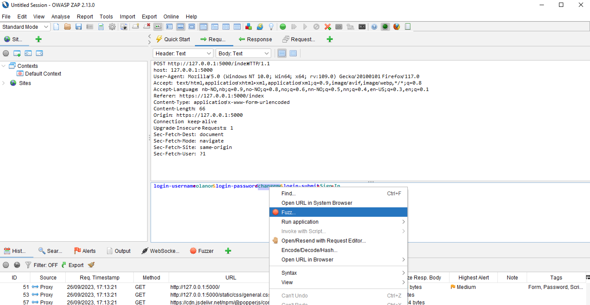
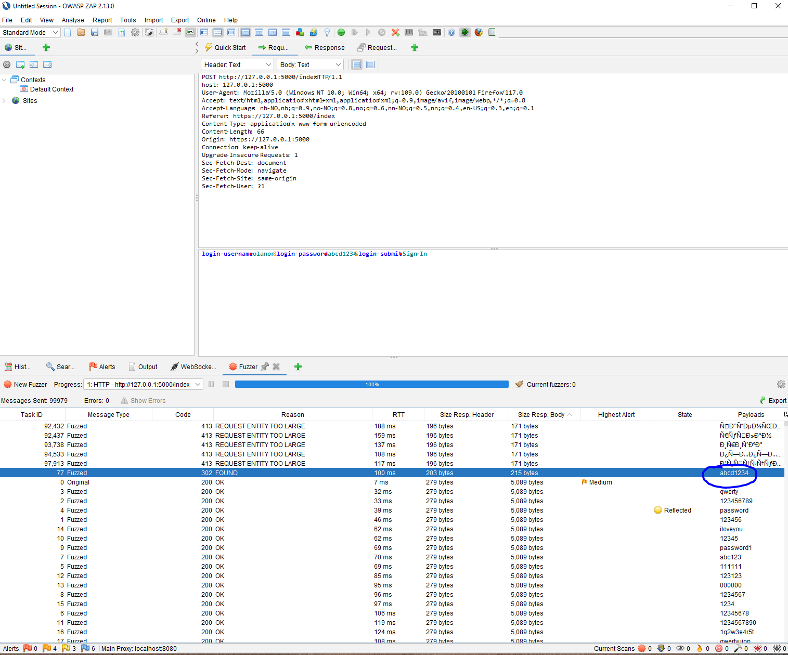
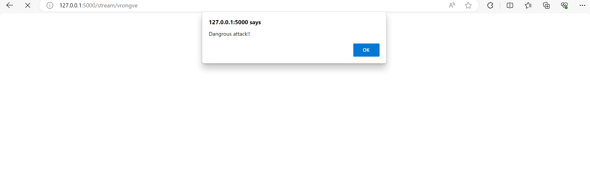

# Social Insecurity - Penetration Testing Report

Single group: Vegard Rongve 
Student number: 225590

## Introduction

Tester: Vegard Rongve

Application: Social Insescurity

Test period: 01.09.2023 - 27.09.2023

The social insecurity web application is a platform where users can connect with friends and share blog posts, encompassing both textual and image-based content. After uploading a post, other users are allowed to comment on eachothers posts. All users of the app will first need to register before logging in. 

The primary ojective of this assignment is to systimatically identify potential vulnerabilities within social insecurity web application, and subsequentially explore methods to exploit them. This assignment is made to improve our abilities to think like potential attackers, with the ultimate aim of enhancing our future application development practice to priotize security or our abilties to work as a penetration tester.

# Vulnerability Assessment

## Black Box Testing

## Weak Password

Category: 
- A07: Identification and Authentication Failures

Descirption: 
- Users of the application have complete freedom to choose their own passwords, without any strict password policy in place. This means they can even select a single-letter password.

Potential Impact:
- The potential impact of having a weak password is significant, as an attacker might get hold sensitiv data (depending on the purpose of the application). An attacker can by using for instance the brut force technique, relatively easy break the password and get access to a user account.
- 

Affected part of the application:
-   The affected part is the registration form of the application where the user is setting a password.


## User enumeration

Category: 
- A05: Security Misconfiguration

Description:
- Interacting with the application allows users to identify valid usernames. When a user enters a valid username during the login process, the application indicates that the password is incorrect. Conversely, if an invalid username is entered, the application informs the user that the user does not exist.

Potential impact:
- It makes it easier for malicous actors to identify valid usernames. Armed with a list of valid usernames, attackers can launch various credential-based attacks, such as bruce force attacks. 
- User enumartion can be seen as a privacy violation, as i exposes information about which usernames are registered with the service. 

Affected part of the applicaton:
- The affected part of the app is the login section. The application provides a notification message in the top of the broweser window when an invalid password or username is entered. 

## Bypassing access control by modifying URL

Cateogory: 
- A01:Broken Access Control

Description:
- By modifying the url, given a valid username, it is possible to login in to the application as that user without entering the password. 

Potential impact:
- It allows unauthorized access to an account by simply knowing the username, which could lead to unauthorized data access, account manipulation, or other securtiy risks.

Affected part of the application:
- The Broken Access Control issue affects the user authentication and authorization system of the application. Specifically, it allows unauthorized access to user accounts by manipulating the URL with a valid username, granting access to the user's account without requiring the correct password.

## Edit another user's profile

Cateogory: 
- A01:Broken Access Control

Description:
- The app is lacking session management. Currently an attacker is able to modify anyones profile by for instance adding the user as friend, and then pressing on the username of that user. By doing so the user will navigate to the profil page of the selected user. Here, a user is able to press the edit button and then modify the profile to another user. 

Potential impact: 
- The potential impact of the describe issue is significant and could have several adverese consequences for the application's security and user data.
  - Unauthorized profile modification:
    - Attackers can modify the profiles of others without their consent or proper authorization. This could lead to the unauthorized modification of personal inforamtion or other user-specific data, potentially causing confusion, misinformation, or privacy breach.
  - Data integrity:
    - Unauthorized profile modification could result in a loss of data integrity as user profiles may contain critical information related to their identify, preferences, or interactions with the application. This could impact the trustworthiness of the platform.

Affected part of the application:
- The affected part of the described issue above is the profle page where the user can edit data about their self. 


## File upload

Category:
- A03:Injection

Description:
- The web app does not give an guidelines for what kind of files that can be uploaded and not. It looks like the app accepts any kind of file extensions. This means that an attacker might potentially upload malicious and dangenrous files. 

Potential Impact:
- Malware distribution. Users can upload malicious files such as viruses, Trojans, or ransomware. These files may be disguised as innocent documents, images, or other harmless formats, making it easier for attackers to spread malware to other users who download or open these files.
- Uploading certain file types can introduce security vulnerabilities to your server. For example, allowing users to upload scripts (e.g., PHP, JavaScript) can lead to potential code execution vulnerabilities if the server doesn't properly validate and sanitize user inputs.


Affacted part of the application:
- The affected part the of the application is the stream page, where users can upload a text and/or image which they want others to see. These post will then be visible to all users of the application, meaning that malicious scripts could potenially reach out to all the users.

## Injecting code into database

Category: 
- A03:Injection

Description
- Due to bad/no form validation i'm able to post a script to the server by entering the script as text in the comment field on the stream page. And due to the lack of output encoding, the web application threats this as a javascript each time the page refreshes.

Potential impact:
- The script injected to the database could potentially be used to create forms where a user might enter sensitive data and sends it to an attacker when saved. So the potential consquence of these kind of attacks are severe.

Affected part fo the application:
- The stream page where all the posts are listed.
- The edit profil page. 

## Multiple users with same password and username

Category:
- A01:Broken Access Control

Description:
- In the social security app, I have identified a critical issue. The system allows the registration of multiple users with identical usernames due to a lack of essential server-side validation checks
  
Potential impact:
- This vulnerability is severe risk as it leads to confusion among users, making it potentially impossible for a logged-in user to discern their actual identify. Furthermore, when making data modifications, the actions of the one logged-in user affect all users sharing the same username, resulting in significant data loss and integrity compromise.

Affected part of the application:
- The issue starts with the registration form, where it is possible to register multiple users with the same username. The problem extends throughout the application, impacting all pages where data is modified and stored in the database, as all users sharing the same username are affected.

## White Box Testing

## Password hashing

Category:
- A02:Cryptographic Failures

Description:
- By looking at the source code no password hashing are identified, which is counted as an cryptographic failure by OWASP, and it is actually on the second place on the OWASP Top Ten Vulnerabilities list.

Potential impact:
- Storing plaintext passwords in a database makes it easier for attackers to steal user credentials if they gain access to the database. A security breach can lead to unauthorized actions taken on behalf of the user.
- Many users reuse passwords across multiple services. If your application does not hash passwords, attackers can potentially reuse these stolen credentials to access the users account on other platforms

Affected part of the application:
- Register user and login.

# Vulnerability Exploitation

## 1. Broken Access Control

#### Step.1 
I registered two user in the app, "vrongve" and "trongve". After registering the two users, i logged in and updated the about page for "vrongve". 

#### Step.2
After updating the user profile for "vrongve" i logged out of the app by cliking the Log Out button. Then i logged in as "trongve" and pressed the friends page where i added the user "vrongve" as a friend. 

#### Step.3
After seeing that "vrongve" appeard as my frind in the list I clicked on the "vrongve" username link, which then took me to the about page of that user.

#### Step.4 
Now the logged in user, which currently is "trongve", is able to press the edit button and then edit the about form for "vrongve.

#### Result:
- After exploiting the broken access control of the app I was able to entierly delete or modify all the userinfo entered by any user on the profile page in the web application. As long an attacker knows the username the attacker may add the user as friend and then clicking on the username to navigate to the profile page or simply just modifying the URL by changing the username. 
If an attacker would enter the following URL "http://127.0.0.1:5000/profile/vrongve" the attacker would be able to modify the profile page for that user. 

## 2. Identification and Authentication Failures

#### Step.1 
Download OZASP Zap and launch the web page through the manual explorer in OWASP Zap. 


#### Step.2 
Register a user with username "olanor" and password "abcd1234". 


After registering the user, try logging in with username "olanor", but set the password equal to "changeme". The application will then tell that the password is incorrect. 


#### Step.3 
No i can go into the OWASP Zap application and look at the latest POST request. I highlighted the POST line in the history view and then pressed the "request" tab in the OWASP Zap application. From this view i can see that the username entered was "olenor" and the password entered was "changeme". 


#### Step.4 
After locating the "changeme" password I highlighted "changeme" and right-clicked. Then i selected "Fuzz" -> "Add" -> "Add" -> Type "File".




After selecting as type I pressed the select file which open a file explorer. Then i located the password wordlist I had downloaded earlier and uploaded that file to OWASP Zap.


After uploading the file i pressed "Start fuzzer". OWASP Zap then starts to test all the different passwords listed in the uploaded file. 


#### Step.5 
When OWASP Zap completed the testing I sorted the tests based on body size and found that there was one test that stod out. I then looked at the value in the payloads column and could see that the one that stod out was the correct password for that username. 



#### Result

Because the social insecurity application stores passwords in plaintext without any password requirements, and it confirms the validity of a username, it is highly vulnerable to brute-force attacks. So by using a brut force technique i was able to defeat the authenticaion mechanism of the application.

## 3. Cross site scripting #1 - Input form

#### Step.1 
I entered <script>window.alert("Dangrous attack!!")</script> into the post comment field on the stream page and submitted the commnet. 


#### Step.2
After clicking the 'Post' button, the page refreshes, and an alert popup message appears. This message continues to appear each time the stream page is refreshed.
Note: A similar behavior can occur on the 'Edit Profile' page due to the absence of form validation and output encoding. Instead of treating the output as text, it's interpreted as JavaScript.



#### Result:

This exploitation shows that the application is vulnerable for cross site scripting which could lead to attackers stealing sensitive user data, such as login credentials, session cookies or personal information. 

## 4. Cross site scripting #2 - File upload

#### Step.1 
I created an SVG file containing javascript code to simulate a Cross-Site Scripting attack scenario. 

```
<?xml version="1.0" standalone="no"?>
<!DOCTYPE svg PUBLIC "-//W3C//DTD SVG 1.1//EN" "http://www.w3.org/Graphics/SVG/1.1/DTD/svg11.dtd">

<svg version="1.1" baseProfile="full" xmlns="http://www.w3.org/2000/svg">
  <polygon id="triangle" points="0,0 0,50 50,0" fill="#009900" stroke="#004400"/>
  <script type="text/javascript">
    alert("XSS by BHARAT");
  </script>
</svg>
```

#### Step.2
I pressed chose file and then uploaded the malicous-file.svg file which contained the script above.


#### Step.3
After posting the file I could see the new post in the list of posts on the stream page. I then right clicked the svg image and pressed "open image in new tab". 


#### Step.4
When I open a new tab, I observe that the JavaScript has executed, as indicated by the appearance of a pop-up alert message.


#### Result:

This exploitation shows that the application is vulnerable for cross site scripting which could lead to attackers stealing sensitive user data, such as login credentials, session cookies or personal information. 

## 5. Cryptographic Failures

#### Step.1 
I opened the social insecurity app and registered a user by entering firstname: Ola, lastname: Nordmann, username: olanor and password: huskeraldri123.


#### Step.2 
After the user-registration I looked around in the source which I have access to and found that a sqlite file was located in the instance folder. After locating this file I went on to download DB Browser (SQLite), which is an open-source and user-friendly tool for working with SQLite databases. The software provides a graphical interface for interacting with SQLite databases, making it easier for users to create, view, edit and manage SQLite database files. 

#### Step.3
After getting the DB Browser (SQLite) application up and running I went on to open the sqlite file located in the application with the DB Browser software.


After opening the file i went on to locate the users table and browsed the current data. By browsing the sqlite file used for storing the data in the social insecurity app I could easily see that the password stored where not hashed. 


#### Result:
If an attacker where to get access to this sqlite file the attacker would get hold of all the usernames and passwords. The attacker wouldent even have to break the hashing as passwords was stored as plain text. An attacker would get complete control over the app and any user using the app.

## Impact Analysis

Discuss the potential consequences if these vulnerabilities were present in a real-world application.

### 1. Cross site scripting
Potential consequence if a real world application has the same cross site scripting vulnerabiltiy as identified in the social insecurity application.
-  Data tefth:
Attackers can steal sensitive user data, such as login credentials, session cookies, or personal information, by injecting malicious scripts into a website.
-  Phising:
Attackers can create convincing phishing pages by injecting malicious scripts into legitimate websites. Users may unknowingly enter their credentials or sensitive information on these fake pages.
- Clickjacking:
Attackers can overlay malicious content on a legitimate website, tricking users into clicking on elements that perform unintended actions without their knowledge.
- Data manipulation:
XSS can be used to modify data within a web application, potentially leading to data corruption or unauthorized changes.

### 2. Broken access control
Potential consequence if a real world application has the same broke access control vulnerabiltiy as identified in the social insecurity application.
- Unauthorized data access:
Attackers can access sensitive information and data belonging to other users, violating their privacy. This information may include personal details, contact information, or confidential data.
- Data modification:
Attackers can maliciously modify or delete data within another user's profile. This could lead to data corruption, loss of information, or unauthorized changes to user settings.
- Reputation demage:
Users affected by this vulnerability may lose trust in the web application and the organization running it, leading to reputational damage and a loss of customers or users.
- Finacial loss:
Security breaches, especially those leading to data theft or fraudulent activities, can result in financial losses for both the affected users and the organization responsible for the application

### 3. Cryptograpic Failures
Potential consequence if a real world application has cryptograpic failures.
- Data exposure:
Attackers may gain access to encrypted data and, through cryptographic weaknesses, decrypt it to reveal sensitive information. This could include personally identifiable information (PII), financial data, or confidential business data.
- Access to passwords and usernames: 
If a real world application did not hash the passwords stored, an attacker could potentially read all usernames and passwords if the attacker where to get hold of the file storing the data.

### 4. Idetification and authentication
Identification and authentication vulnerabilities in a web application can have significant and wide-ranging consequences, especially if they lead to weak passwords and make brute-forcing attacks easier.
- Unauthorized access:
Weak authentication mechanisms can allow attackers to gain unauthorized access to user accounts, systems, or sensitive data within the application.
- Data breach:
Attackers who successfully exploit identification and authentication vulnerabilities can access and potentially steal sensitive user data, such as personal information, financial data, or confidential documents.

## Lessons Learned

In the course of this project, several valuable insights and lessons were gained, shedding light on both the challenges faced and the effective tools and techniques employed in the process of securing web applications.

### Tool Selection: 
The primary tools utilized for this project were web browsers and OWASP Zap. While web browsers provided a practical means to explore the application from an attacker's perspective, OWASP Zap offered an automated approach to vulnerability detection and exploitation. The combination of these tools allowed for a comprehensive assessment of the web application's security posture.

### Attacker's Perspective: 
One of the most effective techniques employed was approaching the application with an attacker's mindset. This approach proved to be invaluable in uncovering vulnerabilities that might otherwise go unnoticed.

### Challenges with OWASP Zap: 
The project also highlighted certain challenges, particularly in regards to using OWASP Zap. These challenges were primarily rooted in the lack of prior exposure and training. Unfortunately, due to unavailability and the absence of recorded lectures, acquiring proficiency in OWASP Zap was more challenging than anticipated.

### Knowledge Acquisition: 
Despite the challenges, the project provided a significant learning opportunity. A deeper understanding of the various ways in which web applications can be exploited was acquired. This newfound knowledge is valuable and will be leveraged in future web application developments.

In conclusion, this project served as a valuable learning experience, highlighting the significance of adopting an attacker's perspective, the challenges associated with security tools, and the critical need for ongoing education and awareness in the field of web application security.


